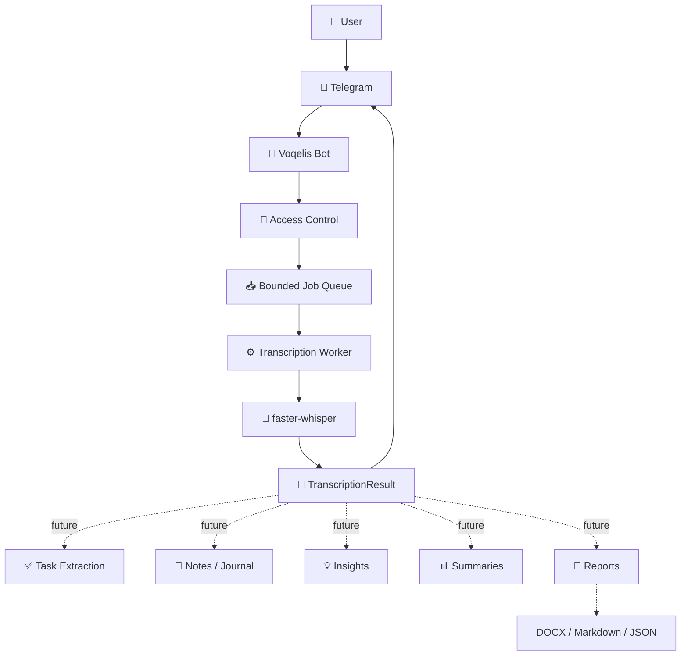

# Voqelis

**Local-first voice intelligence platform for turning speech into useful information.**

Voqelis is a self-hosted platform that receives voice messages through Telegram, processes speech locally with AI, and turns speech into text that can later become structured information.

**Development branch: v0.3.0 — Planner V1**

The first version focuses on one core pipeline:

    🎙️ Voice message
          ↓
    💬 Telegram
          ↓
    🧠 Local speech recognition
          ↓
    📝 Transcription

The current MVP is intentionally small. The architecture is designed so that the same transcription result can become the input for future task extraction, notes, summaries, insights, reports, and other processing modules.

---

## What Voqelis does

For a user, the experience is simple:

    🎙️ Send a voice message
            ↓
    🤖 Voqelis processes it
            ↓
    📝 Receive the transcription

Behind this simple interaction is a modular backend that separates Telegram communication, validation, job processing, and speech recognition.

---

## Architecture



The key architectural boundary is **`TranscriptionResult`**.

Future AI features can consume this stable result instead of being tightly coupled to Telegram or the speech-recognition engine. This makes it possible to add new capabilities without rebuilding the core pipeline.

---

## Built to scale for different tasks

Voqelis is not limited to transcription.

The current version establishes a reusable processing layer:

```text
                    🎙️ Voice / Audio
                           │
                           ▼
                  ┌──────────────────┐
                  │     Voqelis      │
                  │   Core Pipeline  │
                  └────────┬─────────┘
                           │
                    TranscriptionResult
                           │
          ┌────────────────┼────────────────┐
          ▼                ▼                ▼
       Tasks            Notes            Insights
          │                │                │
          └────────────────┼────────────────┘
                           ▼
                Summaries / Reports
                           │
                           ▼
                 DOCX / Markdown / JSON
```

For example, one voice message such as:

> “Tomorrow call the client and finish the report.”

could eventually be processed into:

```text
📝 Transcript
      ↓
┌───────────────────────────────┐
│ Tasks                         │
│ • Call the client             │
│ • Finish the report           │
└───────────────────────────────┘
      +
📊 Summary
      +
📔 Daily note
```

The point is not to predict every future feature. The point is to provide a core that can be extended for **different personal, work, or information-processing tasks**.

---

## Planner V1 — development release v0.3.0

The stable production baseline remains v0.2.0 until Planner V1 is deployed and verified. The `feature/planner-v1` branch adds:

- Telegram voice-message and audio-file input
- Local speech-to-text with `faster-whisper`
- Russian-language transcription
- Access control for authorized users
- File size and duration limits
- Bounded queue and per-user back-pressure
- Single transcription worker for a 1-vCPU server
- Temporary audio cleanup after processing
- Plain-text transcript delivery
- Planner V1 with recurring templates, deterministic conflict-aware scheduling, review flow, and DOCX/PDF export
- Optional Gemini-based structured task/review extraction
- Dedicated unprivileged Linux service account
- `systemd` deployment with service hardening

The MVP deliberately focuses on a reliable foundation before adding higher-level AI processing.

---

## Real-world performance

The current configuration has been tested on the actual production VPS.

| Audio duration | Processing time |
|---:|---:|
| 11.8 s | 3.0 s |
| 44.0 s | 5.8 s |
| 84.0 s | 12.0 s |
| 157.6 s | 29.9 s |

Production environment:

```text
1 vCPU
2 GB RAM
20 GB NVMe
Ubuntu 24.04 LTS
```

Current inference profile:

```text
Model:        faster-whisper base
Device:       CPU
Compute type: INT8
CPU threads:  1
Language:     Russian
```

The configuration is intentionally conservative because Voqelis shares the VPS with other services.

---

## Local-first

Voqelis follows a **local-first** approach.

Telegram provides the convenient user interface and transport layer, while speech recognition runs on infrastructure controlled by the project owner.

This creates a foundation for:

- reducing dependence on paid speech-to-text APIs
- keeping processing under the owner's control
- adding local AI models later
- building private workflows around personal data
- moving the processing core to another server or local machine

Local-first does not mean that every future component must be local. External AI services can be added later as optional modules when they provide a useful capability.

---

## Technology

| Layer | Technology |
|---|---|
| Interface / transport | Telegram Bot |
| Backend | Python |
| Bot framework | aiogram |
| Speech recognition | faster-whisper |
| Audio decoding | PyAV |
| Deployment | systemd |
| Operating system | Ubuntu Linux |
| Version control | Git / GitHub |

---

## Project structure

```text
voqelis/
├── src/voqelis/
│   ├── bot.py
│   ├── audio.py
│   ├── config.py
│   ├── domain.py
│   ├── main.py
│   ├── queue.py
│   ├── text.py
│   └── transcription.py
├── tests/
├── data/.gitkeep
├── .env.example
├── pyproject.toml
├── requirements.txt
├── requirements-dev.txt
├── voqelis.service
├── AUDIT.md
├── SECURITY.md
└── README.md
```

The codebase is organized around separate responsibilities rather than a single monolithic bot script.

---

## Roadmap

```text
v0.1.0
Telegram → Local STT → Text
                │
                ├── Task extraction
                ├── Structured notes
                ├── Daily summaries
                ├── Insights
                ├── Document generation
                └── Local / external LLM modules
```

The roadmap is intentionally flexible. New modules can be added around the existing processing result without changing the basic user interaction.

---

## Project status

**v0.3.0 — Planner V1 (development branch)**

Voqelis v0.2.0 remains the verified production baseline. Planner V1 is implemented on `feature/planner-v1` and must pass code/tests and a controlled VPS deployment test before being called production.

The current goal is to keep the core small, reliable, and resource-aware while gradually turning it into a modular personal information-processing platform.

**From voice transcription to a system for turning unstructured speech into structured information.**

---

## Security and privacy

Audio is stored temporarily on the VPS only for processing and is removed after the job finishes. No paid speech-recognition API is required.

Telegram remains the transport layer, so the original voice/audio necessarily passes through Telegram before Voqelis can download and process it.

Additional deployment and security details are documented in [SECURITY.md](SECURITY.md) and [AUDIT.md](AUDIT.md).

---

## Development

For local development:

```bash
git clone https://github.com/0w1Max/voqelis.git
cd voqelis

python3 -m venv .venv
source .venv/bin/activate

python -m pip install --upgrade pip
python -m pip install -r requirements.txt
python -m pip install -e .
```

Run tests:

```bash
PYTHONPATH=src pytest -q
```

Run lint:

```bash
ruff check .
```

Production deployment details are kept separate from the main project overview so that the README stays focused on the product, architecture, and engineering decisions.

---

## License

No license is included yet because the licensing terms of the original source material should be confirmed before publishing the repository publicly.